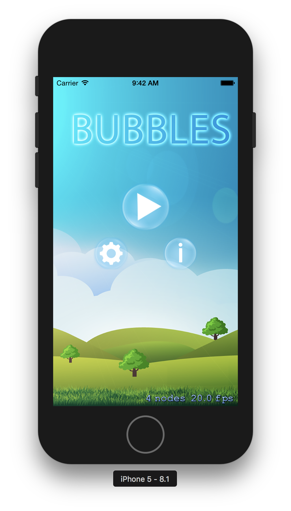
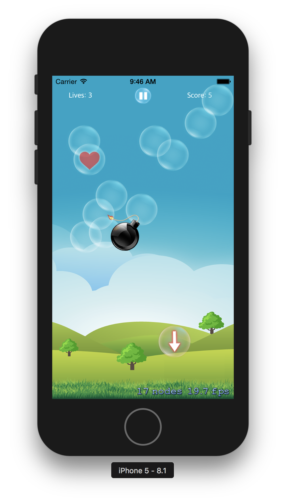
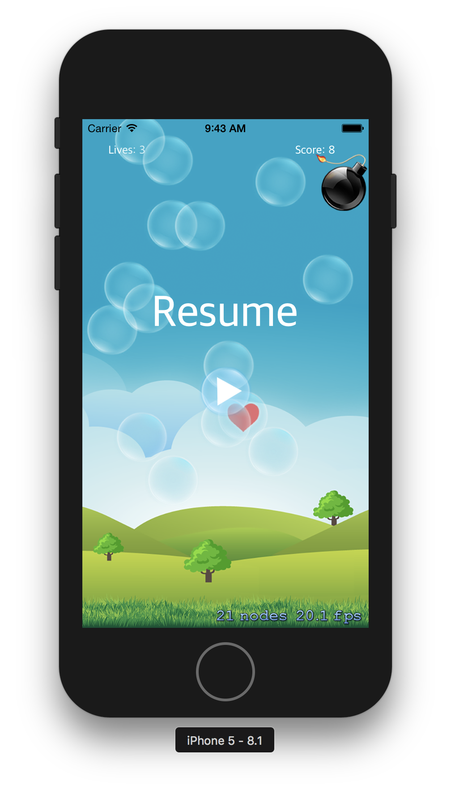
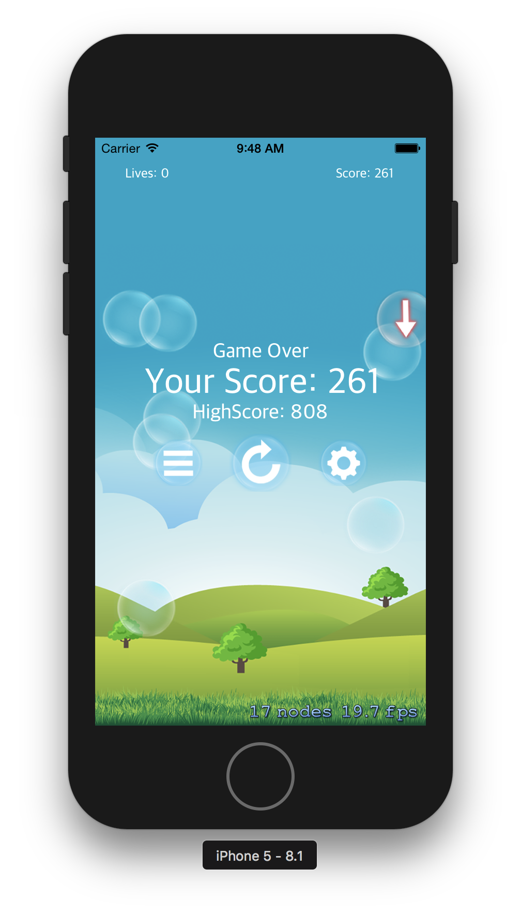

# Bubbles iOS Arcade Game

Bubbles is a game where the user must tap the bubbles before they reach the ground. 
Lives decrease as bubbles hit the ground. There are 4 types of bubbles.

- **Normal bubble:** Must be tapped before reaching the ground; otherwise, lose 1 life
- **Heart bubble:** Increases number of lives by 1
- **Speed-up bubble:** Doubles the speed of the bubbles for 3 seconds
- **Bomb:** Lose the game.

### Main menu

### Play

### Pause

### Game over

